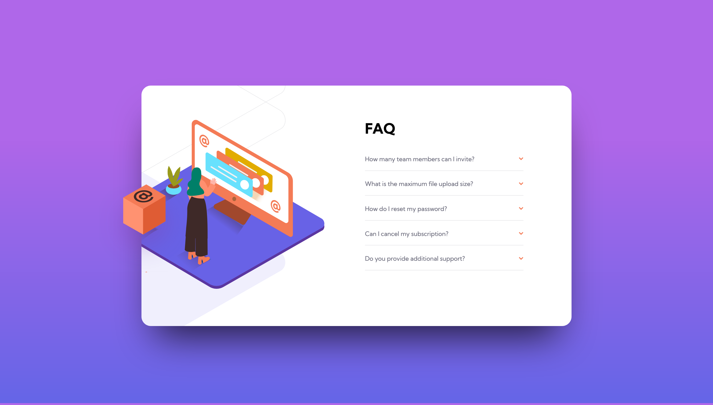

# Frontend Mentor - FAQ accordion card solution

This is a solution to the [FAQ accordion card challenge on Frontend Mentor](https://www.frontendmentor.io/challenges/faq-accordion-card-XlyjD0Oam). Frontend Mentor challenges help you improve your coding skills by building realistic projects. 

## Table of contents

- [Overview](#overview)
  - [The challenge](#the-challenge)
  - [Screenshot](#screenshot)
  - [Links](#links)
- [My process](#my-process)
  - [Built with](#built-with)
  - [What I learned](#what-i-learned)
  - [Useful resources](#useful-resources)
- [Author](#author)

## Overview

### The challenge

Users should be able to:

- View the optimal layout for the component depending on their device's screen size
- See hover states for all interactive elements on the page
- Hide/Show the answer to a question when the question is clicked

### Screenshot

### Links

- Solution URL: [Code](https://github.com/myrdn/faq-accordion-card)
- Live Site URL: [Live Site](https://myrdn.github.io/faq-accordion-card/)

## My process

### Built with

- Semantic HTML5 markup
- CSS custom properties
- Flexbox
- Vanilla JS
- Mobile-first workflow
- ARIA

### What I learned

I learned accessible accordion pattern.

### Useful resources

- [ARIA Authoring Practices Guide](https://www.w3.org/WAI/ARIA/apg/patterns/accordion/) - A really good
  website with code examples for a lot of accessibles patterns.

## Author

- Website - [More-Coffee](https://more-coffee.net)
- Frontend Mentor - [@myrdn](https://www.frontendmentor.io/profile/myrdn)

